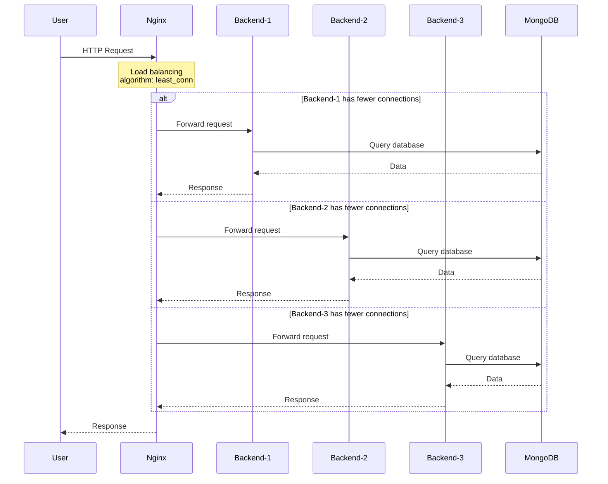

# ⚖️ CHIẾN LƯỢC MỞ RỘNG (SCALING STRATEGY)

**Tài liệu**: Phân tích chiến lược mở rộng hệ thống  
**Ngày**: 28/10/2025  
**Tác giả**: Team T10_N12

---

## 📋 MỤC LỤC

1. [Tổng quan](#1-tổng-quan)
2. [Phân tích replicas](#2-phân-tích-replicas)
3. [Load distribution](#3-load-distribution)
4. [Resource allocation](#4-resource-allocation)
5. [Scaling scenarios](#5-scaling-scenarios)

---

## 1. TỔNG QUAN

### 1.1. Current Replica Configuration

| Service | Replicas | Lý do |
|---------|----------|-------|
| **Backend** | 3 | API server - high traffic, stateless |
| **Frontend** | 2 | Static serving - medium load, stateless |
| **Worker** | 2 | Background jobs - parallel processing |
| **Nginx** | 1 | Load balancer - single entry point |
| **MongoDB** | 1 | Stateful database - single source of truth |
| **Redis** | 1 | In-memory cache - single instance đủ |
| **Visualizer** | 1 | Monitoring UI - low priority |
| **TOTAL** | **12** | Total replicas across cluster |

### 1.2. Scaling Philosophy

```
          HIGH TRAFFIC                 MEDIUM LOAD              LOW LOAD
    ┌─────────────────────┐     ┌──────────────────┐    ┌────────────────┐
    │   Backend × 3       │────▶│  Frontend × 2    │───▶│  Others × 1    │
    │   Worker × 2        │     │                  │    │  (Stateful)    │
    │   (Stateless)       │     │  (Stateless)     │    │                │
    └─────────────────────┘     └──────────────────┘    └────────────────┘
         SCALE OUT                   SCALE OUT            NO SCALING
    (Horizontal scaling)        (Horizontal scaling)   (Vertical only)
```

**Nguyên tắc**:
- **Stateless services**: Scale horizontally (thêm replicas)
- **Stateful services**: Scale vertically (tăng resources) hoặc dùng clustering
- **Critical services**: More replicas (backend, worker)
- **Supporting services**: Fewer replicas (frontend)

---

## 2. PHÂN TÍCH REPLICAS

### 2.1. Backend - 3 Replicas

**Lý do chọn 3**:
1. ✅ **High availability**: Nếu 1 replica down → còn 2 serving traffic
2. ✅ **Load balancing**: Phân tán requests qua 3 instances
3. ✅ **Zero downtime**: Rolling update 1 replica/lần, còn 2 serving
4. ✅ **Odd number**: Tránh split-brain trong consensus algorithms (future-proof)

**Traffic pattern**:
```
            Nginx Load Balancer
                    │
        ┌───────────┼───────────┐
        │           │           │
        ▼           ▼           ▼
   Backend-1    Backend-2    Backend-3
    (33.3%)      (33.3%)      (33.3%)
```

**Failure scenarios**:
- **1 replica down**: 2 còn lại handle 50% each (acceptable)
- **2 replicas down**: 1 còn lại handle 100% (degraded but working)
- **3 replicas down**: Service unavailable (requires manual intervention)

**Capacity planning**:
- Each replica: 500 req/min (theoretical)
- 3 replicas: 1500 req/min total
- Peak traffic: ~800 req/min (53% utilization)
- Room for growth: +87% capacity

### 2.2. Worker - 2 Replicas

**Lý do chọn 2**:
1. ✅ **Parallel processing**: 2 workers process queue simultaneously
2. ✅ **Redundancy**: 1 worker down → còn 1 processing
3. ✅ **Queue distribution**: Bull queue auto-distribute jobs
4. ✅ **Cost effective**: Email sending không cần quá nhiều workers

**Job processing pattern**:
```
         Redis Queue (Bull)
                │
        ┌───────┴───────┐
        │               │
        ▼               ▼
    Worker-1        Worker-2
   (Process A)     (Process B)
        │               │
        └───────┬───────┘
                ▼
         Email sent ✅
```

**Processing capacity**:
- Each worker: ~120 emails/hour (avg 30s per email)
- 2 workers: ~240 emails/hour
- Current volume: ~50-80 emails/hour (33% utilization)

**Job types**:
- Order confirmation emails (high priority)
- Welcome emails (medium priority)
- Password reset emails (high priority)
- Promotional emails (low priority)

### 2.3. Frontend - 2 Replicas

**Lý do chọn 2**:
1. ✅ **Redundancy**: 1 replica down → còn 1 serving
2. ✅ **Static content**: Ít resource-intensive hơn backend
3. ✅ **CDN alternative**: Poor man's CDN với 2 instances
4. ✅ **Update safety**: Rolling update an toàn

**Traffic pattern**:
```
            Nginx Load Balancer
                    │
            ┌───────┴───────┐
            │               │
            ▼               ▼
       Frontend-1      Frontend-2
        (50%)           (50%)
            │               │
            └───────┬───────┘
                    ▼
            Static assets
         (HTML, CSS, JS, images)
```

**Why not 3+ replicas?**:
- Static content → low compute cost
- Nginx already caches static assets
- 2 replicas đủ cho current traffic
- Tiết kiệm resources cho backend/worker

### 2.4. Nginx - 1 Replica

**Lý do chỉ 1**:
1. ✅ **Single entry point**: Nginx là front door, không cần multiple doors
2. ✅ **Lightweight**: Nginx rất efficient, 1 instance handle 10k+ connections
3. ✅ **Port 80 constraint**: Only 1 service bind port 80 (ingress mode)
4. ✅ **Swarm routing mesh**: Swarm auto-route đến replica khả dụng

**High availability**:
```
   External traffic (port 80)
            │
            ▼
    Swarm Routing Mesh
            │
            ▼
        Nginx (1 replica)
            │
  ┌─────────┼─────────┐
  │         │         │
  ▼         ▼         ▼
Backend  Frontend  Other
(3x)      (2x)    (1x each)
```

**Nếu Nginx down**:
- Swarm auto-restart trong 5-10s
- Frontend/Backend services vẫn accessible via direct ports (dev mode)
- Production nên dùng external load balancer (AWS ALB, GCP Load Balancer)

### 2.5. MongoDB & Redis - 1 Replica

**Lý do chỉ 1**:
1. ✅ **Stateful services**: Không thể scale ngang đơn giản
2. ✅ **Data consistency**: Single source of truth tránh conflicts
3. ✅ **Volume persistence**: Data lưu trong volumes, survive restarts
4. ✅ **Current load**: Sufficient for current traffic

**Future scaling options**:

**MongoDB**:
```
   Single instance (current)
            │
            ▼
   MongoDB Replica Set (future)
            │
    ┌───────┼───────┐
    │       │       │
  Primary Secondary Secondary
    (R/W)   (R)     (R)
```

**Redis**:
```
   Single instance (current)
            │
            ▼
   Redis Sentinel (future)
            │
    ┌───────┼───────┐
    │       │       │
  Master  Replica Sentinel
   (R/W)    (R)    (Monitor)
```

---

## 3. LOAD DISTRIBUTION

### 3.1. Request Flow



### 3.2. Load Balancing Algorithm

**Nginx sử dụng `least_conn`**:
```nginx
upstream backend {
    least_conn;  # Chọn backend với ít connections nhất
    server backend:5000 max_fails=3 fail_timeout=30s;
}
```

**So sánh algorithms**:

| Algorithm | Description | Use case |
|-----------|-------------|----------|
| **round_robin** | Xoay vòng đều | Requests tương tự nhau |
| **least_conn** | Ít connections nhất | ✅ Requests khác nhau về processing time |
| **ip_hash** | Dựa vào client IP | Session affinity (sticky sessions) |
| **hash** | Dựa vào custom key | Custom logic |

**Tại sao chọn `least_conn`?**:
- ✅ Requests khác nhau (GET /products fast, POST /orders slow)
- ✅ Tránh overload 1 backend
- ✅ Fair distribution based on actual load

### 3.3. Connection Distribution

**Example scenario**:
```
Initial state:
Backend-1: 0 connections
Backend-2: 0 connections
Backend-3: 0 connections

After 10 requests:
Backend-1: 3 connections (2 long-running)
Backend-2: 4 connections (all short)
Backend-3: 3 connections (1 long-running)

Next request → Backend-2 (most available)
```

---

## 4. RESOURCE ALLOCATION

### 4.1. Total Resources

**CPU allocation**:
```
┌─────────────────────────────────────────────────┐
│ Total CPU: ~3.6 cores                           │
├─────────────────────────────────────────────────┤
│ Backend (3x):   1.5 cores (41.7%)              │
│ Worker (2x):    1.0 cores (27.8%)              │
│ Frontend (2x):  0.5 cores (13.9%)              │
│ MongoDB:        0.5 cores (13.9%)              │
│ Others:         0.1 cores (2.8%)               │
└─────────────────────────────────────────────────┘
```

**Memory allocation**:
```
┌─────────────────────────────────────────────────┐
│ Total Memory: ~3.5 GB                           │
├─────────────────────────────────────────────────┤
│ Backend (3x):   1.5 GB (42.9%)                 │
│ MongoDB:        1.0 GB (28.6%)                 │
│ Worker (2x):    1.0 GB (28.6%)                 │
│ Frontend (2x):  0.5 GB (14.3%)                 │
│ Redis:          0.3 GB (8.6%)                  │
│ Others:         0.2 GB (5.7%)                  │
└─────────────────────────────────────────────────┘
```

### 4.2. Resource Optimization

**Per-replica resources**:

| Service | CPU Limit | Memory Limit | Replicas | Total CPU | Total Memory |
|---------|-----------|--------------|----------|-----------|--------------|
| Backend | 0.5 | 512M | 3 | 1.5 | 1536M |
| Worker | 0.5 | 512M | 2 | 1.0 | 1024M |
| Frontend | 0.25 | 256M | 2 | 0.5 | 512M |
| MongoDB | 1.0 | 1G | 1 | 1.0 | 1024M |
| Redis | 0.25 | 256M | 1 | 0.25 | 256M |
| Nginx | 0.25 | 128M | 1 | 0.25 | 128M |
| Visualizer | 0.1 | 64M | 1 | 0.1 | 64M |
| **TOTAL** | | | **12** | **3.6** | **4544M (~4.4G)** |

**Host requirements**:
- Minimum: 4 CPU cores, 6GB RAM
- Recommended: 8 CPU cores, 12GB RAM (50% buffer)
- Production: 16 CPU cores, 24GB RAM (100% buffer)

---

## 5. SCALING SCENARIOS

### 5.1. Traffic Patterns

**Daily pattern**:
```
 Requests/min
     │
1500 ├─────────────────────────────────────────
     │                    ╱╲
1000 ├───────────────────╱  ╲────────────────
     │              ╱───╱    ╲───╲
 500 ├─────────╱───╱              ╲───╲──────
     │    ╱───╱                        ╲───╲─
   0 └────────────────────────────────────────
     0  3  6  9  12 15 18 21 24  (hours)
     
     Morning   Peak      Evening   Night
     (low)    (high)     (medium)  (low)
```

**Peak hours**: 10:00 - 14:00, 18:00 - 21:00  
**Low hours**: 00:00 - 06:00

### 5.2. Scaling Actions

**Scenario 1: Traffic tăng 2x**
```bash
# Scale backend
docker service scale ecommerce_backend=5

# Scale worker (if email queue grows)
docker service scale ecommerce_worker=3

# Scale frontend (if static requests increase)
docker service scale ecommerce_frontend=3
```

**New distribution**:
- Backend: 3 → 5 (capacity +67%)
- Worker: 2 → 3 (capacity +50%)
- Frontend: 2 → 3 (capacity +50%)

**Scenario 2: Black Friday / Sales event**
```bash
# Pre-scale before event
docker service scale ecommerce_backend=7
docker service scale ecommerce_worker=4
docker service scale ecommerce_frontend=4

# Monitor and adjust
docker service logs ecommerce_backend --follow

# Scale down after event
docker service scale ecommerce_backend=3
docker service scale ecommerce_worker=2
docker service scale ecommerce_frontend=2
```

**Scenario 3: MongoDB reaching limits**
```bash
# Option 1: Vertical scaling (increase resources)
docker service update \
  --limit-cpu 2 \
  --limit-memory 2G \
  ecommerce_mongo

# Option 2: Migrate to MongoDB Replica Set
# (Requires architecture change)
```

### 5.3. Auto-scaling (Future)

**Docker Swarm không hỗ trợ auto-scaling native**, nhưng có thể implement:

**Option 1: Custom script**
```bash
#!/bin/bash
# auto-scale.sh

# Get current CPU usage
CPU=$(docker stats --no-stream --format "{{.CPUPerc}}" ecommerce_backend | cut -d'%' -f1)

if (( $(echo "$CPU > 80" | bc -l) )); then
  echo "High CPU, scaling up..."
  CURRENT=$(docker service inspect -f '{{.Spec.Mode.Replicated.Replicas}}' ecommerce_backend)
  NEW=$((CURRENT + 1))
  docker service scale ecommerce_backend=$NEW
fi
```

**Option 2: Kubernetes (migration)**
```yaml
# HorizontalPodAutoscaler
apiVersion: autoscaling/v2
kind: HorizontalPodAutoscaler
metadata:
  name: backend-hpa
spec:
  scaleTargetRef:
    apiVersion: apps/v1
    kind: Deployment
    name: backend
  minReplicas: 3
  maxReplicas: 10
  metrics:
  - type: Resource
    resource:
      name: cpu
      target:
        type: Utilization
        averageUtilization: 70
```

### 5.4. Scaling Metrics

**Monitor these metrics**:
```bash
# CPU usage
docker stats --no-stream --format "table {{.Name}}\t{{.CPUPerc}}\t{{.MemUsage}}"

# Response time
curl -w "@curl-format.txt" -o /dev/null -s http://localhost:8080/api/health

# Request rate
docker service logs ecommerce_nginx | grep -c "200 OK"

# Queue length
docker exec $(docker ps -q -f name=ecommerce_redis) redis-cli LLEN emailQueue
```

**Thresholds**:
- CPU > 70%: Consider scaling
- Response time > 200ms: Scale immediately
- Queue length > 100: Scale workers
- Error rate > 1%: Investigate before scaling

---

## 6. KẾT LUẬN

### 6.1. Scaling Strategy Summary

✅ **Backend 3 replicas**: High availability, load distribution  
✅ **Worker 2 replicas**: Parallel processing, redundancy  
✅ **Frontend 2 replicas**: Redundancy, cost-effective  
✅ **Nginx 1 replica**: Single entry point, efficient  
✅ **Stateful 1 replica**: Data consistency  

### 6.2. Key Decisions

1. **Prioritize backend scaling**: API server là bottleneck chính
2. **Worker parallelism**: Email queue cần parallel processing
3. **Frontend minimal**: Static content không cần nhiều replicas
4. **Stateful vertical**: MongoDB/Redis scale vertically hoặc clustering
5. **Nginx single**: Load balancer không phải bottleneck

### 6.3. Future Improvements

1. **Implement monitoring**: Prometheus + Grafana
2. **Auto-scaling**: Custom scripts hoặc migrate Kubernetes
3. **Database clustering**: MongoDB Replica Set, Redis Sentinel
4. **Cache layer**: Redis cache cho frequent queries
5. **CDN**: Cloudflare/AWS CloudFront cho static assets

---

**Chiến lược mở rộng được thiết kế dựa trên traffic patterns, resource constraints, và high availability requirements.**

**Người tạo**: Team T10_N12  
**Ngày**: 28/10/2025
